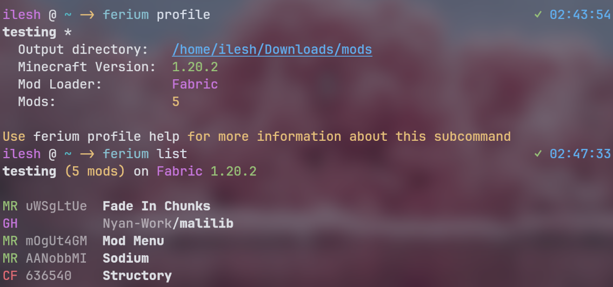
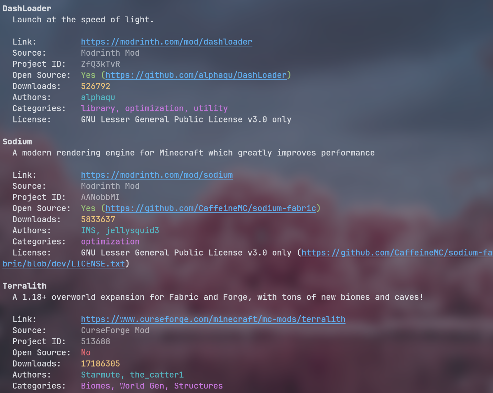
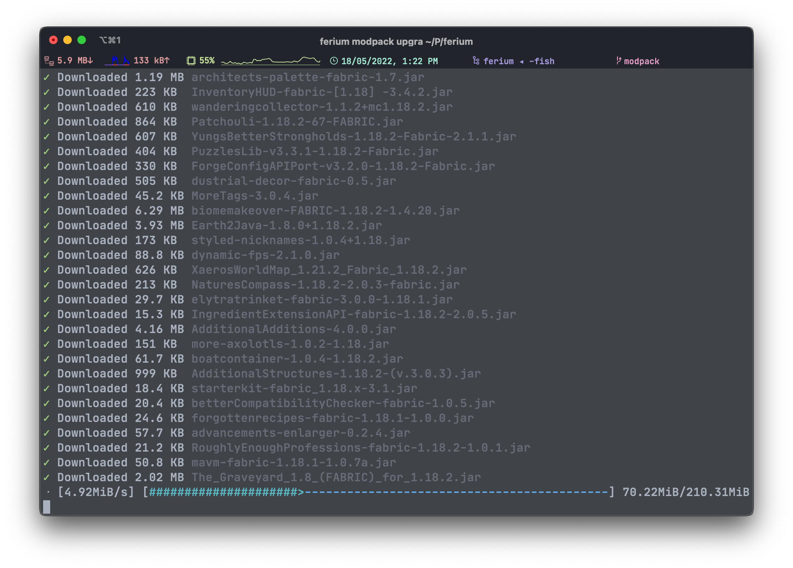

# OGJ Ferium

This is my version of Ferium, which manages profiles differently and is therefore not compatible with the original [Ferium](https://github.com/gorilla-devs/ferium) by GorillaDevs. Instead of using a single `config.json` file for all profiles, each profile is saved as a separate `json` file. This approach simplifies profile distribution and is in my opinion better, though this is subjective, which is why it's a fork and not a pull request.

[](https://www.rust-lang.org)
[](https://github.com/gorilla-devs/ferium/blob/main/LICENSE.txt)
[](https://github.com/gorilla-devs/ferium/actions/workflows/build.yml)

> Check out ferium's sister projects [ferinth](https://github.com/gorilla-devs/ferinth) and [furse](https://github.com/gorilla-devs/furse).
> They are Rust wrappers for the official Modrinth and CurseForge APIs respectively.

Ferium is a fast and feature rich CLI program for downloading and updating Minecraft mods from [Modrinth](https://modrinth.com/mods), [CurseForge](https://curseforge.com/minecraft/mc-mods), and [GitHub Releases](https://docs.github.com/en/repositories/releasing-projects-on-github/about-releases), and modpacks from [Modrinth](https://modrinth.com/modpacks) and [CurseForge](https://curseforge.com/minecraft/modpacks).
Simply specify the mods you use, and in just one command you can download the latest compatible version of all the mods you configured.

## Features

- Use the CLI to easily automate your modding experience
- Download mods from multiple sources, namely [Modrinth](https://modrinth.com/mods), [CurseForge](https://curseforge.com/minecraft/mc-mods), and [GitHub Releases](https://docs.github.com/en/repositories/releasing-projects-on-github/about-releases)
- Download modpacks from multiple sources, namely [Modrinth](https://modrinth.com/modpacks) and [CurseForge](https://curseforge.com/minecraft/modpacks)
- <details>
    <summary>Beautiful and informative UI</summary>

    #### Profile info and listing mods
    

    #### Listing mods verbosely
    

    #### Upgrading mods/modpacks
    
  </details>

- <details>
    <summary>It's super fast due to multithreading for network intensive tasks</summary>

    Your results may vary depending on your internet connection.

    It downloads my modpack [Kupfur](https://github.com/theRookieCoder/Kupfur) with 79 mods in 15 seconds:

    https://github.com/gorilla-devs/ferium/assets/60034030/cfe2f0aa-3c10-41ca-b223-367925309ea9

    It downloads [MMTP](https://www.curseforge.com/minecraft/modpacks/mats-mega-tech-pack), a very large modpack with around 400 mods, in just under a minute:

    https://github.com/gorilla-devs/ferium/assets/60034030/857e8d27-372d-4cdd-90af-b0d77cb7e90c
  </details>

- Upgrade all your mods to the latest compatible version in one command, `ferium upgrade`
  - Ferium checks that the version being downloaded is the latest one that is compatible with the configured mod loader and Minecraft version
- Download and install the latest version of your modpack in one command, `ferium modpack upgrade`
- Create multiple profiles and configure different mod loaders, Minecraft versions, output directories, and mods for each

## Installation

Ferium executables from GitHub Releases do not require any external dependencies at runtime.  
If you compile from source on Linux, using GCC to build will result in binaries that require GCC to be available at runtime.  
On Linux, the regular versions require some sort of desktop environment to be available that offers an XDG Desktop Portal to show the folder picker.
The `nogui` versions do not need this as they won't have a GUI folder picker, making these variants suitable for server use.

> [!IMPORTANT]
> Linux users! Use the `nogui` versions (or compile with `--no-default-features`) if you do not have a desktop environment (like GNOME, KDE, XFCE, etc.)

### Packages

Have knowledge/experience maintaining packages? Consider [helping with adding and maintaining ferium for your favourite package manager.](https://github.com/gorilla-devs/ferium/discussions/292)

#### [Arch User Repository](https://aur.archlinux.org) for _Arch Linux_

[](https://aur.archlinux.org/packages?K=ferium)

> [!NOTE]
> From-source builds will install the Rust toolchain and GCC.

| Installation method                             | GUI file dialogue                                                       | No GUI                                                      |
| ----------------------------------------------- | ----------------------------------------------------------------------- | ----------------------------------------------------------- |
| Install pre-built binaries from GitHub Releases | **[ferium-gui-bin](https://aur.archlinux.org/packages/ferium-gui-bin)** | [ferium-bin](https://aur.archlinux.org/packages/ferium-bin) |
| Build from source at the latest tag             | [ferium-gui](https://aur.archlinux.org/packages/ferium-gui)             | [ferium](https://aur.archlinux.org/packages/ferium)         |
| Build from source using the latest commit       | [ferium-gui-git](https://aur.archlinux.org/packages/ferium-gui-git)     | [ferium-git](https://aur.archlinux.org/packages/ferium-git) |

#### [Homebrew](https://brew.sh) for _macOS_ or _Linux_
[](https://formulae.brew.sh/formula/ferium)
```bash
brew install ferium
```

#### [winget](https://learn.microsoft.com/en-us/windows/package-manager/winget) for _Windows_
[](https://winstall.app/apps/GorillaDevs.Ferium)

```powershell
winget install GorillaDevs.Ferium
```

#### [Scoop](https://scoop.sh) for _Windows_
[](https://scoop.sh/#/apps?q=ferium&id=d17eaa5fe92af6d5eddb853f06bf27d162cadbba)
```powershell
scoop bucket add games
scoop install ferium
```

#### [Pacstall](https://pacstall.dev) for _Ubuntu_
[](https://pacstall.dev/packages/ferium-bin)
```bash
pacstall -I ferium-bin
```

#### [Nixpkgs](https://nixos.wiki/wiki/Nixpkgs) for _NixOS_ or _Linux_
[](https://search.nixos.org/packages?show=ferium&channel=unstable)  
> [!NOTE]
> See the package page for installation instructions:  
> https://search.nixos.org/packages?show=ferium&channel=unstable

#### [Portage](https://wiki.gentoo.org/wiki/Portage) for _Gentoo_
Available on [LoaTcHi's overlay](https://github.com/Loatchi/loatchi-overlay)
```bash
eselect repository enable loatchi
emaint sync -r loatchi
emerge -av ferium
```

#### [XBPS](https://xbps-api-docs.voidlinux.org) for _Void Linux_
[](https://voidlinux.org/packages/?q=ferium)
```bash
xbps-install ferium
```

#### [crates.io](https://crates.io) using the _Rust toolchain_
[](https://crates.io/crates/ferium)
```bash
cargo install ferium
```
> [!TIP]
> Use a tool like [cargo-update](https://crates.io/crates/cargo-update) to keep ferium updated to the latest version!

#### GitHub Releases
[](https://github.com/gorilla-devs/ferium/releases)
> [!IMPORTANT]
> You will have to manually download and install every time there is a new update.

1. Download the asset suitable for your operating system from the [latest release](https://github.com/gorilla-devs/ferium/releases/latest)
2. Unzip the file and move it to a folder in your path, e.g. `~/bin`
3. Remember to check the releases page for any updates!

## Overview / Help Page

> [!NOTE]
> A lot of ferium's backend is in a separate project; [libium](https://github.com/theRookieCoder/libium).  
> It deals with things such as the config, adding mod(pack)s, upgrading, file pickers, etc.

### Program Configuration

Ferium stores profile and modpack information in its config file. By default, this is located at `~/.config/ferium/config.json`.  
You can change this in 2 ways, setting the `FERIUM_CONFIG_FILE` environment variable, or setting the `--config-file` global flag.
The flag always takes precedence.

> [!CAUTION]
> Be mindful of syntax when manually editing the config file

You can also set a custom CurseForge API key or GitHub personal access token using the `CURSEFORGE_API_KEY` and `GITHUB_TOKEN` environment variables, or the `--curseforge_api_key` and `--github-token` global flags respectively.
Again, the flags take precedence.

### First Startup

You can either have your own set of mods in what is called a 'profile', or install a modpack.

- [Create a new profile](#creating) by running `ferium profile create` and entering the details for your profile.
  - Then, [add your mods](#adding-mods) using `ferium add`.
  - Finally, download your mods using `ferium upgrade`.
- [Add a modpack](#adding-modpacks) by running `ferium modpack add <project_id>`.
  - After which, run `ferium modpack upgrade` to download and install the latest version of the modpack.

### Automatically Import Mods

```bash
ferium scan
```

This command scans a directory with mods, and attempts to add them to your profile.

The directory defaults to your profile's output directory. Some mods are available on both Modrinth and CurseForge; ferium will prefer Modrinth by default, but you can choose CurseForge instead using the `--platform` flag.

As long as you ensure the mods in the directory match the configured mod loader and Minecraft version, they should all add properly. Some mods might require some [additional tuning](#check-overrides). You can also bypass the compatibility checks using the `--force` flag.

### Manually Adding Mods

> [!TIP]
> You can specify multiple identifiers to add multiple mods at once

#### Modrinth
```bash
ferium add project_id
```

`project_id` is the slug or project ID of the mod. (e.g. [Sodium](https://modrinth.com/mod/sodium) has the slug `sodium` and project ID `AANobbMI`). You can find the slug in the website URL (`modrinth.com/mod/<slug>`), and the project ID at the bottom of the left sidebar under 'Technical information'.  
So to add [Sodium](https://modrinth.com/mod/sodium), you can run `ferium add sodium` or `ferium add AANobbMI`.

#### CurseForge
```bash
ferium add project_id
```
`project_id` is the project ID of the mod. (e.g. [Terralith](https://www.curseforge.com/minecraft/mc-mods/terralith) has the project id `513688`). You can find the project id at the top of the right sidebar under 'About Project'.  
So to add [Terralith](https://www.curseforge.com/minecraft/mc-mods/terralith), you should run `ferium add 513688`.

#### GitHub
```bash
ferium add owner/name
```
`owner` is the username of the owner of the repository and `name` is the name of the repository, both are case-insensitive (e.g. [Sodium's repository](https://github.com/CaffeineMC/sodium) has the id `CaffeineMC/sodium`). You can find these at the top left of the repository's page.  
So to add [Sodium](https://github.com/CaffeineMC/sodium), you should run `ferium add CaffeineMC/sodium`.

> [!IMPORTANT]
> The GitHub repository needs to upload JAR files to their _Releases_ for ferium to download, or else it will refuse to be added.

#### User Mods

If you want to use files that are not downloadable by ferium, place them in a subfolder called `user` in the output directory. Files here will be copied to the output directory when upgrading.

> [!NOTE]
> Profiles using Quilt will not copy their user mods, this is because Quilt automatically loads mods from nested directories (such as the user folder) since version `0.18.1-beta.3`.

### Adding Modpacks

#### Modrinth
```
ferium modpack add project_id
```
`project_id` is the slug or project ID of the modpack. (e.g. [Fabulously Optimized](https://modrinth.com/modpack/fabulously-optimized) has the slug `fabulously-optimized` and project ID `1KVo5zza`). You can find the slug in the website URL (`modrinth.com/modpack/<slug>`), and the project id at the bottom of the left sidebar under 'Technical information'.  
So to add [Fabulously Optimized](https://modrinth.com/modpack/fabulously-optimized), you can run `ferium modpack add fabulously-optimized` or `ferium modpack add 1KVo5zza`.

#### CurseForge
```
ferium modpack add project_id
```
`project_id` is the project ID of the modpack. (e.g. [Fabulously Optimized](https://www.curseforge.com/minecraft/modpacks/fabulously-optimized) has the project ID `396246`). You can find the project ID at the top of the right sidebar under 'About Project'.  
So to add [Fabulously Optimized](https://www.curseforge.com/minecraft/modpacks/fabulously-optimized), you should run `ferium modpack add 396246`.

### Upgrading Mods

> [!WARNING]
> If your output directory is not empty when setting it, ferium will offer to create a backup.  
> Please do so if it contains any files you would like to keep.

Now after adding all your mods, run `ferium upgrade` to download all of them to your output directory.
This defaults to `.minecraft/mods`, where `.minecraft` is the default Minecraft resources directory. You don't need to worry about this if you play with Mojang's launcher and use the default resources directory.
You can choose to pick a custom output directory during profile creation or [change it later](#configure-1).

If ferium fails to download a mod, it will print its name in red and try to give a reason. It will continue downloading the rest of your mods and will exit with an error.

> [!TIP]
> When upgrading, any files not downloaded by ferium will be moved to the `.old` folder in the output directory.  
> See [user mods](#user-mods) for information on how to add mods that ferium cannot download.

### Upgrading Modpacks

> [!WARNING]
> If your output directory's `mods` and/or `resourcepacks` folders are not empty when setting it, ferium will offer to create a backup.  
> Please do so if it contains any files you would like to keep.

Now after adding your modpack, run `ferium modpack upgrade` to download the modpack to your output directory.
This defaults to `.minecraft`, which is the default Minecraft resources directory. You don't need to worry about this if you play with Mojang's launcher and use the default resources directory.
You can choose to pick a custom output directory when adding the modpack or [change it later](#configure).

If ferium fails to download a mod, it will print its name in red and try to give a reason. It will continue downloading the rest of the mods and will exit with an error.

> [!CAUTION]
> If you choose to install modpack overrides, your existing configs may be overwritten when upgrading.

### Managing Mods

You can list out all the mods in your current profile by running `ferium list`. If you want to see more information about them, you can use `ferium list -v` or `ferium list --verbose`.

You can remove any of your mods using `ferium remove`; just select the ones you would like to remove using the space key, and press enter once you're done. You can also provide the names or IDs of the mods to remove as arguments.

> [!IMPORTANT]
> Both mod names and GitHub repository identifiers are case insensitive.  
> Mod names with spaces have to be given in quotes (`ferium remove "ok zoomer"`) or the spaces should be escaped (usually `ferium remove ok\ zoomer`, but depends on the shell).

#### Check Overrides

If some mod is supposed to be compatible with your game version and mod loader, but ferium does not download it, [create an issue](https://github.com/gorilla-devs/ferium/issues/new?labels=bug&template=bug-report.md) if you think it's a bug.

If you suspect the author has not specified compatible versions or mod loaders, you can disable the game version or mod loader checks by using the `--ignore-game-version` and/or `--ignore-mod-loader` flags when adding a single mod, or manually setting `check_game_version` and/or `check_mod_loader` to false for the specific mod in the config file.

For example, [Just Enough Items](https://www.curseforge.com/minecraft/mc-mods/jei) does not specify the mod loader for older Minecraft versions such as `1.12.2`. In this case, you would add JEI by running `ferium add 238222 --ignore-mod-loader` so that the mod loader check is disabled.  
You can also manually disable the mod loader (and/or game version) check(s) in the config like so:
```json
{
    "name": "Just Enough Items (JEI)",
    "identifier": {
        "CurseForgeProject": 238222
    },
    "check_mod_loader": false
}
```

### Managing Modpacks

#### Adding

When adding a modpack, you will configure the following:

- Output directory
  - This defaults to `.minecraft`, which is the default Minecraft resources directory. You don't need to worry about this if you play with Mojang's launcher and use the default resources directory.
- Whether to install modpack overrides

> [!TIP]
> You can also provide these settings as flags to avoid interactivity for things like scripts

> [!NOTE]
> Ferium will automatically switch to the newly added modpack

#### Configuring

You can configure these same settings afterwards by running `ferium modpack configure`. Again, you can provide these settings as flags.

#### Manage

You can list out all the modpacks you have added by running `ferium modpack list` or `ferium modpacks`.  
Switch to a different modpack using `ferium modpack switch`.  
Remove a modpack using `ferium modpack remove` and selecting the modpack you want to remove.

### Profiles

#### Creating

You can create a profile by running `ferium profile create` and specifying the following:

- Output directory
  - This defaults to `.minecraft/mods` where `.minecraft` is the default Minecraft resources directory. You don't need to worry about this if you play with Mojang's launcher and use the default resources directory.
- Name of the profile
- Minecraft version
- Mod loader

If you want to copy the mods from another profile, use the `--import` flag.
You can also directly provide the profile name to the flag if you don't want a profile picker to be shown.

> [!NOTE]
> Ferium will automatically switch to the newly created profile

> [!TIP]
> You can also provide these settings as flags to avoid interactivity for things like scripts


#### Configure

You can configure these same settings afterwards by running `ferium profile configure`. Again, you can provide these settings as flags.

#### Manage

You can get information about the current profile by running `ferium profile` or `ferium profile info`, and about all the profiles you have by running `ferium profiles` or `ferium profile list`.  
Switch to a different profile using `ferium profile switch`.  
Delete a profile using `ferium profile delete` and selecting the profile you want to delete.

## Feature Requests

If you would like to make a feature request, check the [issue tracker](https://github.com/gorilla-devs/ferium/issues?q=is%3Aissue+label%3Aenhancement) to see if the feature has already been added or is planned.
If not, [create a new issue](https://github.com/gorilla-devs/ferium/issues/new/choose).

## Developing

Firstly, you will need the Rust toolchain, which includes `cargo`, `rustup`, etc. You can install these [using rustup](https://www.rust-lang.org/tools/install).
You can manually run cargo commands if you wish, but I recommend using the `justfile` configuration in the repository. [`just`](https://just.systems/man/en) is a command runner that is basically a much better version of `make`.

To build the project and install it to your Cargo binary directory, clone the project and run `just install`.
If you want to install it for testing purposes, [add the nightly toolchain](https://doc.rust-lang.org/book/appendix-07-nightly-rust.html#rustup-and-the-role-of-rust-nightly) and run `just` (aliased to `just install-dev`), which has some optimisations to make compilation faster.

You can run integration tests using `cargo test`, lint using `cargo clippy`, and delete all build and test artefacts using `just clean`.

If you would like to see how to cross-compile for specific targets (e.g. Linux ARM) or other information such as the development libraries required, have a look at the [workflow file](.github/workflows/build.yml).  
If you still have doubts, feel free to [create a discussion](https://github.com/gorilla-devs/ferium/discussions/new?category=q-a) and I will try help you out.
