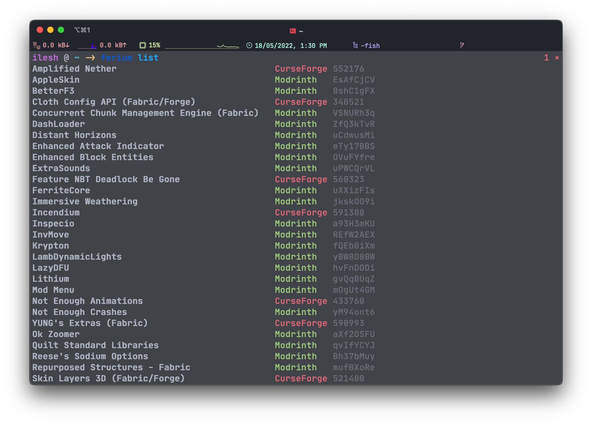

# Ferium

[](https://www.rust-lang.org/)
[](https://github.com/theRookieCoder/ferium/blob/main/LICENSE.txt)
[![copyleft badge](https://img.shields.io/static/v1?label=&message=Copyleft&style=for-the-badge&labelColor=silver&color=silver&logo=data:image/png;base64,iVBORw0KGgoAAAANSUhEUgAAADIAAAAyCAQAAAC0NkA6AAAABGdBTUEAALGPC/xhBQAAACBjSFJNAAB6JgAAgIQAAPoAAACA6AAAdTAAAOpgAAA6mAAAF3CculE8AAAAAmJLR0QA/4ePzL8AAAAHdElNRQfjAxYBNgYPa+9oAAAEM0lEQVRYw6WYb0zVVRjHP9wQW7umA0xoKNSC+6bSNkzetKZbaVu19aLpfOGcbcw/S+uNbikuNwMsVyE3XVsro7VEXjS3ylmLxkRtC9crHGjCAv9AATK4CoZye8Hl/J7n/M7v8rvX57w55/lznt/583yf5/xyCEOlrKaSCp6ggCiQYJheLvMHv9HHA1MZ++kmmaZ1UUNZ9g6eo4X7aR3Mtvs0syJzB0U0MR3KgddOsiQTFxsZzdDBTLvFetd0OT5OHo1U+7j9tNJBN4MkgChFVLCS1Sz1aR7jHf5Lv4Yov1hfN8YRKgP1V9LIuGVxhmg6Fwv4XalPcJD8OTe3gA+YVHYXgt3kWato46nQp1jOWWs1eW7Fz5VaLbkZ3cdc6pX9UfeNkvd+a1aRtV3Fle+mLeGWEO/0mT/EWo7SxhBjjNDPKfbxtMPNVjHLKMVa+I0Q1lmG89nDTWdctPGqz80hIT+uAWRaGOqzeJEraQOw2YrzXNqNbJrlnqDFsCeJKZO3uDtnnN+wNq6cCSM74SGtd1wHlfrOkHAyyDPKrk5codIZ1n7DSlAoVF9iKjRq/cVCYZnPmJHsnWF1GcYRobiQf3yA3sr7VPM2cXp9br5Va2k0/EsAy4SixKh6a5LT6rQibGBAyaeV9SohWQabzeBvhUcTaoqPHHhdTKfSOaWk1wx/E8TN4CuhssW6pjnOCF/KiNrOxULWZPgNEbEJF4VKFT2mdbGLpNNJPzVqC9eKkTdbDK4ajy9ngVaPiHuU5AshWWe4VyIsMuwbWTi5Q7sYlYj+TdNbFBHpJZEV8vao8sOjMS8VRh64MkumrRhSh5UQ+T278s+jQdF/1PTGI4yaweNZuHiYF1RsyCiapdFcengyNajgZyP4RBhP8RpDAU42KcxqE30vNK7KYJQpploFY1NgnfmvApYiZxpskLAi6/PFVh454HBRyJ9K5yclvS5hJQggP7YA8vvZzJCi1+m3NKoUYnj8Eg31jSonDFuTTPEju9nIZuq55IP6FvUJ3iF0zjBqApLWOu6FTlp9FCgM90rX9/zpt1Z9z56QLkasatnLRfe8TT5pmHetQqI6RAoesB5A5aIy/s5jrxAl0VmrJHqFvrQuflCwCPM4Jy71s1L0tTA75IPzAyo5ea3D8eg5LORf2mWqnGaXz3Q+b3CcDm6nCtBfqeV5R+xsUyf1mC3eoBLp9qzAcocquN90qRxTW/Fhxk+Hw8o+HvQIOqPU2qkI7SLGeauAmhf8YrygVCepU0HmpkLqLaQ7nz43Ra3VJBknzqpA/SrivofpaduF64n9Kdt83OupJ/YA48ACiolRyRpHovuMd5kKs8PrA+JirjbsvlFBlE9DyP8qXnQ3+eNiblpOc+gfOCc0gGRGpeyzymq7dbLXSmch/q24qIQ1VBKjjMLUT7UheunmIq2qQgmg/wHquM6d9tIV7AAAACV0RVh0ZGF0ZTpjcmVhdGUAMjAxOS0wMy0yMlQwMTo1NDowNiswMDowMOIizoUAAAAldEVYdGRhdGU6bW9kaWZ5ADIwMTktMDMtMjJUMDE6NTQ6MDYrMDA6MDCTf3Y5AAAAAElFTkSuQmCC)](https://en.wikipedia.org/wiki/Copyleft)

> Check out ferium's sister projects [ferinth](https://github.com/theRookieCoder/ferinth) and [furse](https://github.com/theRookieCoder/furse).
> They are Rust wrappers for the official Modrinth and CurseForge APIs respectively

Ferium is a fast and feature rich CLI program for downloading and updating Minecraft mods from [Modrinth](https://modrinth.com/mods), [CurseForge](https://curseforge.com/minecraft/mc-mods), and [GitHub Releases](https://docs.github.com/en/repositories/releasing-projects-on-github/about-releases), and modpacks from [Modrinth](https://modrinth.com/modpacks) and [CurseForge](https://curseforge.com/minecraft/modpacks).
Simply specify the mods or modpacks you use through the CLI, and in just one command you can download all the mods or the modpack you configured.

## Features

- Download mods from multiple sources, namely [Modrinth](https://modrinth.com/mods), [CurseForge](https://curseforge.com/minecraft/mc-mods), and [GitHub Releases](https://docs.github.com/en/repositories/releasing-projects-on-github/about-releases)
- Download modpacks from multiple sources, namely [Modrinth](https://modrinth.com/modpacks) and [CurseForge](https://curseforge.com/minecraft/modpacks)
- Pleasing and beautiful UI
  - Listing mods
    
  - Listing mods verbosely
    
  - Upgrading mods/modpacks
    
- It's super fast due to multithreading for network intensive tasks
  [](https://asciinema.org/a/DkgxFE9TbKTklhNPAy3eGygrl)
  - Of course, the real world speed still depends on your internet connection
- Upgrade all your mods in one command, `ferium upgrade`
  - Ferium checks that the version being downloaded is the latest one compatible with the chosen mod loader and Minecraft version
  - You can configure overrides for mods that are not specified as compatible but still work
- Download and install your modpack in one command, `ferium modpack upgrade`
- Create multiple profiles and configure different mod loaders, Minecraft versions, output directories, and mods for each

## Installation

Ferium is a compiled, statically linked program that does not require external dependencies.
On Linux, the regular version requires some sort of desktop environment that offers an XDG Desktop Portal. The `nogui` versions do not need this.

Ferium is coming to more package managers soon!
[Tracking Issue](https://github.com/theRookieCoder/ferium/issues/42)

### Arch User Repository (Arch Linux)

- [GUI](https://aur.archlinux.org/packages/ferium-gui-bin)
- [GUI from Source](https://aur.archlinux.org/packages/ferium-gui-git)
- [No GUI](https://aur.archlinux.org/packages/ferium-bin)
- [No GUI from Source](https://aur.archlinux.org/packages/ferium-git)

From source builds will install the Rust toolchain.
GUI builds require any XDG compatible desktop environment to be available at runtime.

### Homebrew (macOS and Linux)

Available [here](https://formulae.brew.sh/formula/ferium) in the core formulae repository.

Run `brew install ferium` to install.

### Scoop (Windows)

Available [here](https://scoop.sh/#/apps?q=ferium) in Scoop's official games bucket.

Run `scoop bucket add games` then `scoop install ferium` to install.

### Pacstall (Ubuntu Linux)

Available [here](https://pacstall.dev/packages/ferium-bin)

Run `pacstall -I ferium-bin` to install.

### Nix Packages

Available [here](https://search.nixos.org/packages?channel=unstable&show=ferium&query=ferium) in the unstable channel.

### Cargo Install (Cross Platform)

If you have the Rust toolchain installed, you can compile and install ferium from source by running `cargo install ferium`.

Remember to use an add-on like [cargo-update](https://crates.io/crates/cargo-update) to keep ferium updated to the latest version!

### GitHub Releases (Manual - Cross Platform)

1. Download the asset suitable for your operating system from [the latest release](https://github.com/theRookieCoder/ferium/releases/latest)
2. Unzip the file and move it to a folder in your path, e.g. `~/bin`
3. Remember to check the releases page for any updates!

## Overview / Help Page

> Note! A lot of ferium's backend is in a separate project [libium](https://github.com/theRookieCoder/libium).
> It deals with things such as the config, adding mod(pack)s, upgrading, file pickers, etc

Ferium stores profile and modpack information in its config file. By default it is located at `~/.config/ferium/config.json`, but you can change this in 2 ways. You can set the `FERIUM_CONFIG_FILE` environment variable or set the `--config-file` global command flag, the flag always takes precedence.

You can also set a custom CurseForge API key or GitHub personal access token using the `CURSEFORGE_API_KEY` and `GITHUB_TOKEN` environment variables or the `--curseforge_api_key` and `--github-token` flags respectively. Again, the flags take precedence.

### First Startup

You can either have your own set of mods in what is called a 'profile', or install a modpack.

- Create a new profile by running `ferium profile create` and entering the details for your profile
  - Then, add your mods using `ferium add`
  - Finally, download your mods using `ferium upgrade`
- Add a modpack by running `ferium modpack add <project_id>`
  - After which, run `ferium modpack upgrade` to download and install the modpack

### Adding Mods

- Modrinth Mods
  - `ferium add project_id`
  - Where `project_id` is the slug or project id of the mod
    - For example, [Sodium](https://modrinth.com/mod/sodium) has the slug `sodium` and a project id `AANobbMI`
    - You can find the slug in the website url (`modrinth.com/mod/<slug>`), and the project id at the bottom of the left sidebar under 'Technical information'
  - So to add [Sodium](https://modrinth.com/mod/sodium), you should run `ferium add sodium` or `ferium add AANobbMI`
- CurseForge Mods
  - `ferium add project_id`
  - Where `project_id` is the project id of the mod
    - For example, [Terralith](https://www.curseforge.com/minecraft/mc-mods/terralith) has a project id `513688`
    - You can find the project id at the top of the right sidebar under 'About Project'
  - So to add [Terralith](https://www.curseforge.com/minecraft/mc-mods/terralith), you should run `ferium add 513688`
- GitHub 'Mods'
  - `ferium add owner/name`
  - Where `owner` is the username of the owner of the repository and `name` is the name of the repository (both case-insensitive)
    - For example [Sodium's repository](https://github.com/CaffeineMC/sodium-fabric) has the id `CaffeineMC/sodium-fabric`
    - You can find these at the top left part of the repository's page as a big 'owner / name'
  - So to add [Sodium](https://github.com/CaffeineMC/sodium-fabric), you should run `ferium add CaffeineMC/sodium-fabric` (again, case-insensitive)
  - Note: The GitHub repository has to release JAR files in their Releases for ferium to download, or else it will refuse to be added
- External mods
  - If you want to use files that are not downloadable by ferium, place them in the `user` folder in the output directory. Files here will be copied to the output directory when upgrading

### Adding Modpacks

- Modrinth Modpacks
  - `ferium modpack add project_id`
  - Where `project_id` is the slug or project id of the modpack
    - For example, [Better Minecraft](https://modrinth.com/modpack/better-minecraft) has the slug `better-minecraft` and a project id `shFhR8Vx`
    - You can find the slug in the website url (`modrinth.com/modpack/<slug>`), and the project id at the bottom of the left sidebar under 'Technical information'
  - So to add [Better Minecraft](https://modrinth.com/modpack/better-minecraft), you should run `ferium modpack add better-minecraft` or `ferium modpack add shFhR8Vx`
- CurseForge Mods
  - `ferium modpack add project_id`
  - Where `project_id` is the project id of the modpack
    - For example, [RLCraft](https://www.curseforge.com/minecraft/modpacks/rlcraft) has a project id `285109`
    - You can find the project id at the top of the right sidebar under 'About Project'
  - So to add [RLCraft](https://www.curseforge.com/minecraft/modpacks/rlcraft), you should run `ferium modpack add 285109`

### Upgrading Mods

> If your output directory is not empty when setting it, ferium will offer to create a backup. Please do so if it contains any files you would like to keep

Now after adding all your mods, run `ferium upgrade` to download all of them to your output directory.
This defaults to `.minecraft/mods`, where `.minecraft` is the default Minecraft resources directory. You don't need to worry about this if you play with Mojang's launcher (unless you changed the resources directory).
You can choose to pick a custom output directory during profile creation or [change it later](#profiles).

If ferium fails to download a mod, it will print its name in red and give the reason. It will continue downloading the rest of the mods and will exit with an error.

**WARNING:** _When upgrading, any files not downloaded by ferium will be moved to the `.old` folder in the output directory_

### Upgrading Modpacks

> If your output directory's `mods` and `resourcepacks` are not empty when setting it, ferium will offer to create a backup. Please do so if it contains any files you would like to keep

Now after adding all your mods, run `ferium modpack upgrade` to download the modpack to your output directory.
This defaults to `.minecraft`, which is the default Minecraft resources directory. You don't need to worry about this if you play with Mojang's launcher (unless you changed the resources directory).
You can choose to pick a custom output directory when adding modpacks or [change it later](#managing-modpacks).

If ferium fails to download a mod, it will print its name in red and give the reason. It will continue downloading the rest of the mods and will exit with an error.

**WARNING:** _If you choose to install modpack overrides, your existing configs may be overwritten_

### Managing Mods

You can see all the mods in your current profile by running `ferium list`. If you want to see more information about them, you can run `ferium list -v` or `ferium list --verbose`.

You can remove any of your mods by running `ferium remove`, selecting the ones you would like to remove by using the space key, and pressing enter once you're done.
You can also provide the names of the mods to remove as arguments. Mod names with spaces have to be given in quotes (`ferium remove "ok zoomer"`) or the spaces should be escaped (`ferium remove ok\ zoomer`).

#### Check Overrides

If some mod is compatible with your profile but ferium does not download it, [create an issue]((https://github.com/theRookieCoder/ferium/issues/new)) if you think it's a bug. You can disable the game version or mod loader checks by using the `--dont-check-game-version` and/or `--dont-check-mod-loader` flags when adding the mod, or manually setting `check_game_version` or `check_mod_loader` to false for the specific mod in the config.

For example, [Just Enough Items](https://www.curseforge.com/minecraft/mc-mods/jei) does not specify the mod loader for older minecraft versions such as `1.12.2`. In this case, you would add JEI by running `ferium add 238222 --dont-check-mod-loader` so that the mod loader check is disabled.
You can also manually disable the mod loader (and/or game version) check(s) in the config like so
```json
{
    "name": "Just Enough Items (JEI)",
    "identifier": {
        "CurseForgeProject": 238222
    },
    "check_mod_loader": false
}
```

### Managing Modpacks

#### Add
When adding a modpack, you will configure the following:

- Output directory
  - This defaults to `.minecraft`, which is the default Minecraft resources directory. You don't need to worry about this if you play with Mojang's launcher (unless you changed the resources directory)
- Whether to install modpack overrides

You can also provide these settings as flags.
Ferium will automatically switch to the newly added modpack.

#### Configure

You can configure these same settings afterwards by running `ferium modpack configure`.
Again, you can provide these settings as flags.

#### Manage

You can see all the modpack you have configured by running `ferium modpack list`.
Switch between your modpacks using `ferium modpack switch`.
Delete a profile by running `ferium modpack delete` and selecting the modpack you want to delete.

### Profiles

#### Create
You can create a profile by running `ferium profile create` and configuring the following:

- Output directory
  - This defaults to `.minecraft/mods` where `.minecraft` is the default Minecraft resources directory. You don't need to worry about this if you play with Mojang's launcher (unless you changed the resources directory)
- Name of the profile
- Minecraft version
- Mod loader

You can also provide these settings as flags.
If you want to copy the mods from another profile, provide the `--import` flag. You can also directly provide a profile name to the flag if you don't want a profile picker to be shown.
Ferium will automatically switch to the newly created profile.

#### Configure

You can configure those same settings afterwards by running `ferium profile configure`.
Again, you can provide these settings as flags.

#### Manage

You can see all the profiles you have by running `ferium profile list`.
Switch between your profiles using `ferium profile switch`.
Delete a profile by running `ferium profile delete` and selecting the profile you want to delete.

## Feature Requests

If you would like to make a feature request, check the [issues](https://github.com/theRookieCoder/ferium/issues?q=is%3Aissue) to see if the feature has already been added or is planned. If not, [create a new issue](https://github.com/theRookieCoder/ferium/issues/new).

## Building from Source or Working on ferium

Firstly, you need the Rust toolchain which includes `cargo`, `rustup`, etc. You can install these from [the Rust website](https://www.rust-lang.org/tools/install).
You'll also need the [`just`](https://github.com/casey/just#installation) command runner, which is basically a much better version of `make`.

To build the project and install it to your Cargo binary directory, clone the project and run `just install`. If you want to install it for testing a development version, run `just` (alias for `just install-dev`).

If you want to obtain executables for specific targets, you can run `just build-<target>` and replace `<target>` with `mac-intel`, `mac-arm` `win`, `win-gnu`, `linux`, or `linux-nogui`. The produced binaries will be zipped and moved to `out/`. `just build-linux-nogui` is for building binaries that don't need GTK, but they will not have a GUI file dialogue.

You can run clippy lints using `just lint`, integration tests using `cargo test`, and delete all the build and test artefacts using `just clean`.
